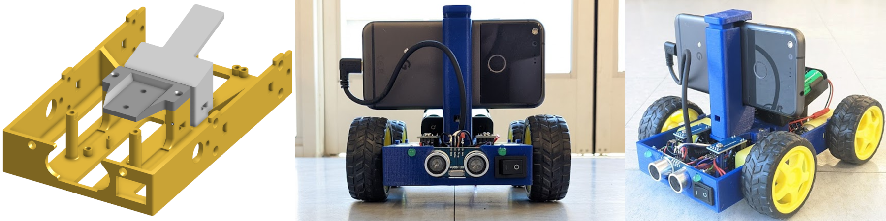
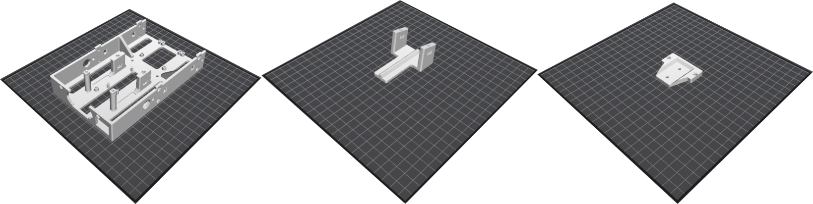
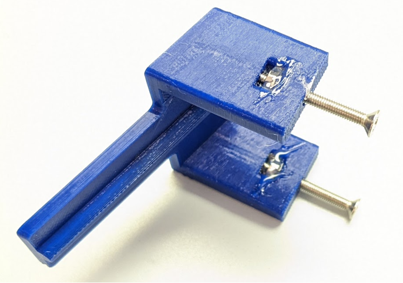
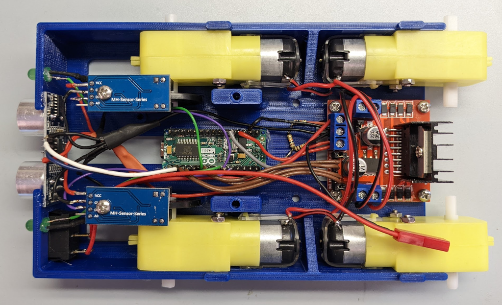
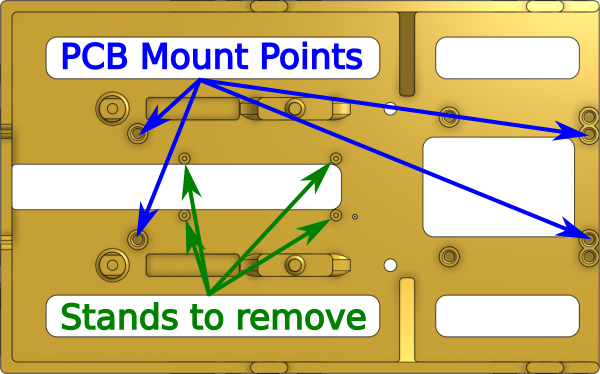
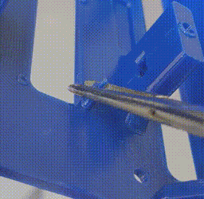
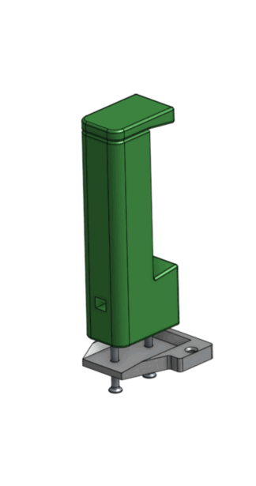
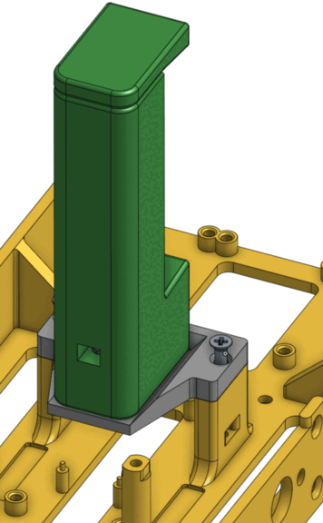
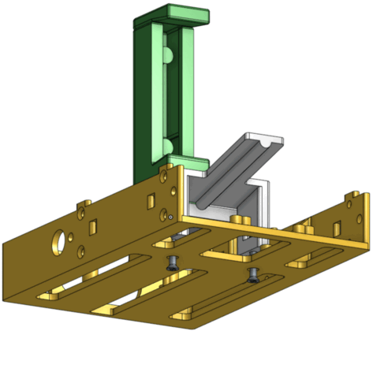
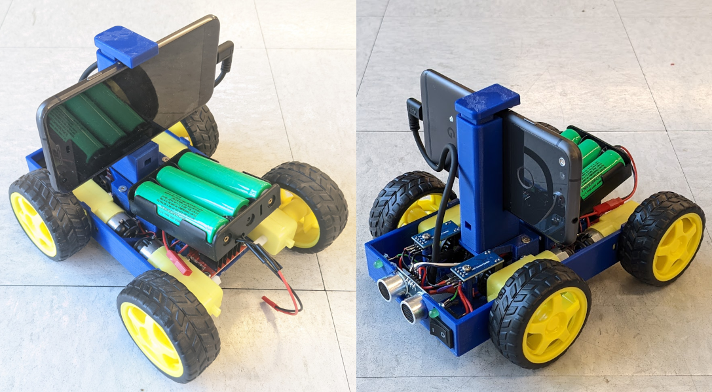

# OpenBot-CompactBody

This is an alternative to the original [OpenBot](https://www.openbot.org/) body that can be made faster, with less plastic, and on 3d printers with smaller build volumes.
The minimum build volume is **161 x 100 x 32mm**.

Most components (motors, wheels, phone, sonar, encoders) are in the exact same positions as the original.
This means the kinematics are the same, and a [URDF](http://wiki.ros.org/urdf) or [SDFormat](http://sdformat.org/) file for the original may still be usable with the Compact Body.
There are few exceptions:
  * the LEDs are mounted on the front instead of the rear
  * there is no space for the optional OLED screen
  * the power switch is mounted on the front instead of the top

## Printing it

Parts:
  
* `compact_body` [.stl](cad/compact_body.stl) [.step](cad/compact_body.step)
* `compact_phone_plate` [.stl](cad/compact_phone_plate.stl) [.step](cad/compact_phone_plate.step)
* `compact_battery_mount` [.stl](cad/compact_battery_mount.stl) [.step](cad/compact_battery_mount.step)

You'll also need to print the original [`phone_mount_bottom` and `phone_mount_top`](https://github.com/isl-org/OpenBot/tree/e99d19224f31dc0bd887e847b58db6c55c3338ed/body/diy#3d-printing).

See the photo above for orientation on the build plate.
A layer height of 0.2mm is fine, and no supports are needed.
Infill around 15-20% is fine.
It's been tested with PETG, but any other rigid plastic should work too.

## Assembly

### 1. Hot glue M3 nuts before making electrical connections

Hot glue the nuts for the battery mount and phone plate before beginning the rest of the assembly.
Insert the nuts into the slots and thread the screws through them.
Pull on the screw to seat the nut, then hot glue it.
Remove the screws when the glue solidifies.

### 2. Mount components and solder all electrical connections

Follow the [OpenBot DIY assembly instructions](https://github.com/isl-org/OpenBot/tree/e99d19224f31dc0bd887e847b58db6c55c3338ed/body/diy#assembly).

The compact body was tested with the DIY wiring option.
Here's what it looks like with all wires connected.

The compact body has points for a PCB to be mounted using 4 M3x5 screws.
The 4 Arduino Nano stands need to be broken off to use them.

**Only break off the stands if you are using the OpenBot PCB. Do not break them off otherwise.**

No testing has been done with a real PCB.
If you try it out, please open an issue to say if it works.

### 3. Mount the phone holder to the phone plate

Mount the phone holder to the top of the phone plate using two M3x25 screws and M3 nuts.

### 4. Attach the phone plate to the body

Attach the phone plate using two M3x25 screws and M3 nuts.

### 5. Attach the battery mount to the body

Attach the battery mount using two M3x25 screws and M3 nuts.

### 6. Glue the battery holder to the battery mount

Put a line of hot glue onto the battery mount and press the battery holder onto it.

### Assembly complete!

Your robot should look something like this.

